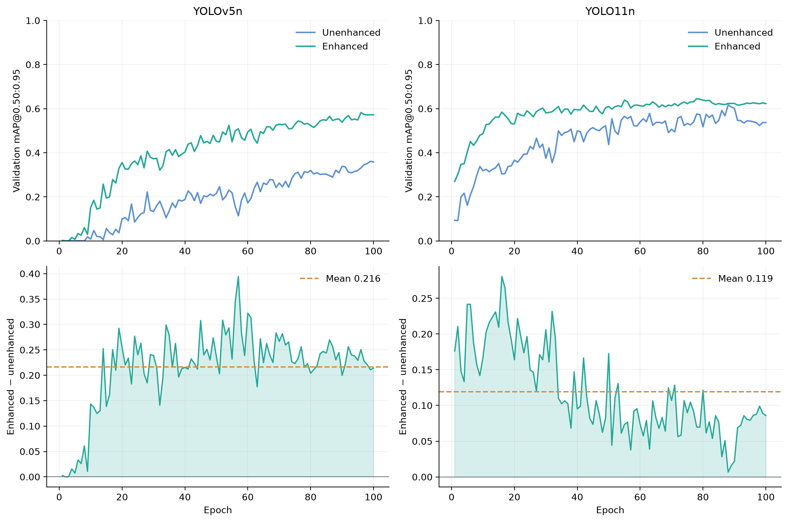

<div align="center">

# A Lagrangian View of Trading Pixels for Parameters

**Kabir Murjani · Aum Joshi · Kuntal Bhattacharjee**<br>
Nirma University, Ahmedabad, India


[Method](#method) · [Usage](#installation-and-local-operation) · [Results](#recorded-validation-results) · [Citation](CITATION.cff)

</div>

---

PIXELS implements the six-stage underwater image compensator and computational allocation model described in *A Lagrangian View of Trading Pixels for Parameters*. The formulation treats preprocessing and detection as coupled uses of an inference budget. The software supports local image transformation, preservation of paired dataset splits, detector training and inference, validation, model export, trajectory analysis, and finite-candidate allocation.

This repository contains the supplied unenhanced and enhanced YOLOv5n and YOLO11n experiment artifacts. The scientific authors are **Kabir Murjani, Aum Joshi, and Kuntal Bhattacharjee**. The authors acknowledge **Team AUV Nirma** for the underwater dataset used in the study.

## Method

The compensator applies red-channel mean correction, gray-world white balance, independent channel CLAHE, Laplacian sharpening, channelwise contrast stretching, and bilateral filtering in that order:

$$
T_\phi=S_{5,75,75}\circ\mathcal C[N\circ L_{0.3}\circ E_{2.0,(10,10)}]\circ W\circ C.
$$

The allocation objective compares detectors trained for their corresponding input representations:

$$
\max_{\phi\in\Phi,\,\theta\in\Theta(\phi)} U(\theta,\phi)
\quad\text{subject to}\quad c_{\mathrm{pre}}(\phi)+c_{\mathrm{net}}(\theta)\le B.
$$

For an interior solution of a differentiable relaxation with an active budget, the marginal returns satisfy $F_p=F_n=\lambda$. Boundary solutions require the full KKT inequalities. Discrete configurations are selected by direct feasible enumeration; the implementation also computes the optimal Lagrangian upper bound and any finite-candidate duality gap. The allocation, KKT, dual-bound, and substitution equations are implemented in `scr/mathematics.py`. The numerical compensator uses float64 channel arithmetic, uint8 quantization before CLAHE, an axial four-neighbor Laplacian, reflected borders, and float32 bilateral filtering. Zero-mean and constant channels pass through their respective undefined rescaling operations unchanged. These conventions resolve details unspecified in the historical implementation record.

## Recorded validation results

The table below is derived from the supplied CSV histories. Each row uses the epoch with maximum validation mAP@0.50:0.95 within that run. Precision, recall, and mAP@0.50 come from the same row.

| Detector | Input | mAP@0.50 | mAP@0.50:0.95 | Precision | Recall |
|:--|:--|--:|--:|--:|--:|
| YOLOv5n | Unenhanced | 0.54084 | 0.36109 | 0.87755 | 0.45497 |
| YOLOv5n | Enhanced | 0.81016 | 0.58214 | 0.71007 | 0.80166 |
| YOLO11n | Unenhanced | 0.75030 | 0.61669 | 0.68317 | 0.75855 |
| YOLO11n | Enhanced | 0.83895 | 0.64552 | 0.81284 | 0.83667 |

The corresponding mAP@0.50:0.95 gains are **0.22105** for YOLOv5n and **0.02883** for YOLO11n. The manuscript additionally discusses YOLOv8n; its underlying run artifacts were not supplied and are not included in this archive.



These are single-seed validation results. The same validation split supported checkpoint selection and reporting. Release order is not a measured capacity axis, and the historical runs contain no complete preprocessing or end-to-end latency measurements. The recorded gains therefore do not establish an optimal deployment allocation. The supplied configurations record AdamW and patience 20 for YOLOv5, and automatic optimizer selection and patience 30 for YOLO11. Archived `best.pt` files were not evaluated to verify their correspondence to the maximum-mAP history rows.

## Installation and local operation

Use an isolated Python environment. Install the image-processing and analysis package from this directory:

```bash
python -m venv .venv
source .venv/bin/activate
python -m pip install -e .
```

Neural operations use the upstream detector implementations:

```bash
python -m pip install -e '.[neural]'
```

YOLOv5 operations additionally require an existing local checkout of `ultralytics/yolov5` and that checkout's dependencies. Supply all images, dataset descriptors, and model weights as local paths. The wrappers require an existing weight file and do not fetch datasets. Dependency installation and some upstream initialization behavior may still require network access.

Process a local image directory and save all intermediate stages and histograms:

```bash
python -m scr enhance --input /absolute/path/to/images --output runs/compensation --stages
```

Create a compensated copy of a local YOLO dataset while retaining its split membership, class IDs, and annotations:

```bash
python -m scr prepare --data /absolute/path/to/data.yaml --representation enhanced --output data/enhanced
```

Run the supplied compensated YOLO11 checkpoint on raw local images:

```bash
python -m scr predict --family v11 --weights results/enhanced/v11/weights/best.pt --input /absolute/path/to/images --representation enhanced --output runs/predictions
```

Regenerate the archive summaries and figures:

```bash
python -m scr summarize --results results --output runs/summary
```

Run `python -m scr --help` for training, native validation, prediction, ONNX export, latency measurement, standalone metrics, and allocation commands. Each command provides its arguments through `--help`. Newly generated runs use separate output directories. Neural training, inference, and tests were not executed when this repository was assembled; the included aggregate figures were produced from the supplied historical logs.

## Repository organization

```text
pixels/
├── scr/
│   ├── stage_1_red.py
│   ├── stage_2_balance.py
│   ├── stage_3_clahe.py
│   ├── stage_4_sharpen.py
│   ├── stage_5_stretch.py
│   ├── stage_6_bilateral.py
│   ├── input.py
│   ├── output.py
│   ├── processing.py
│   ├── neural.py
│   ├── mathematics.py
│   ├── metrics.py
│   ├── plots.py
│   ├── __main__.py
│   └── __init__.py
├── results/
│   ├── unenhanced/
│   │   ├── v5/{images,plots,logs,config,weights}/
│   │   └── v11/{images,plots,logs,config,weights}/
│   ├── enhanced/
│   │   ├── v5/{images,plots,logs,config,weights}/
│   │   └── v11/{images,plots,logs,config,weights}/
│   ├── summary/
│   └── manifest.json
├── CITATION.cff
├── citation.bib
├── references.bib
└── pyproject.toml
```

All executable project code resides in `scr`. Each compensation stage has its own Python module. The source contains no comments or docstrings.

## Citation and acknowledgments

Please cite the authors and this repository when using the implementation or archived results:

```bibtex
@misc{murjani2026pixels,
  author = {Murjani, Kabir and Joshi, Aum and Bhattacharjee, Kuntal},
  title = {A Lagrangian View of Trading Pixels for Parameters},
  year = {2026},
  howpublished = {Manuscript and accompanying software},
  url = {https://github.com/Kcbir/pixels},
  note = {Manuscript prepared for ICVGIP 2026; publication metadata pending}
}
```

The source manuscript identifies the **17th Indian Conference on Computer Vision, Graphics and Image Processing (ICVGIP 2026)**, December 21–24, 2026, Kolkata, India. Conference details are provided by the [official ICVGIP website](https://icvgip.in/2026/). This repository does not assert acceptance or an issued proceedings DOI. The citation should be updated when final publication metadata becomes available.

The authors acknowledge **Team AUV Nirma** for the dataset. The original study used Roboflow for dataset creation and annotation. The raw dataset and its split manifests are not distributed here. Detector implementations and pretrained model lineages are credited to [Ultralytics YOLOv5](https://github.com/ultralytics/yolov5) and [Ultralytics](https://github.com/ultralytics/ultralytics); image operators use [OpenCV](https://opencv.org/). The manuscript bibliography is retained in [references.bib](references.bib). Upstream detector components and derived weights remain subject to their applicable terms. No software or dataset license was supplied; contact the authors for reuse terms.
